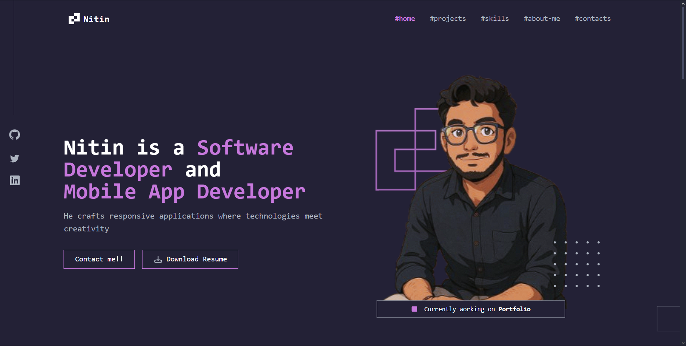
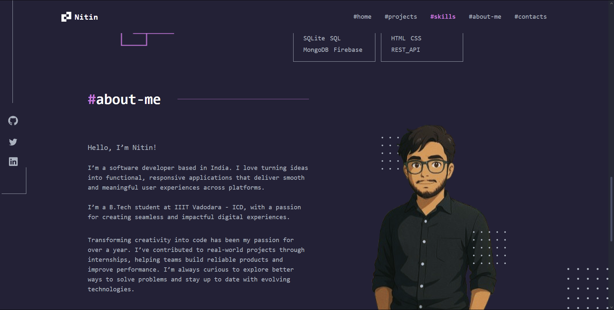
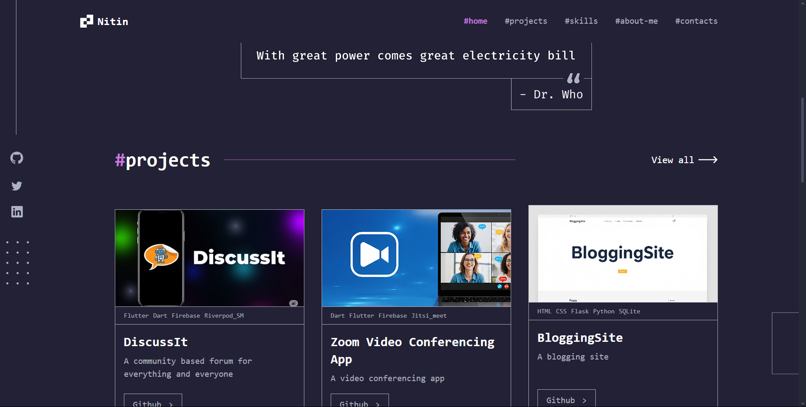
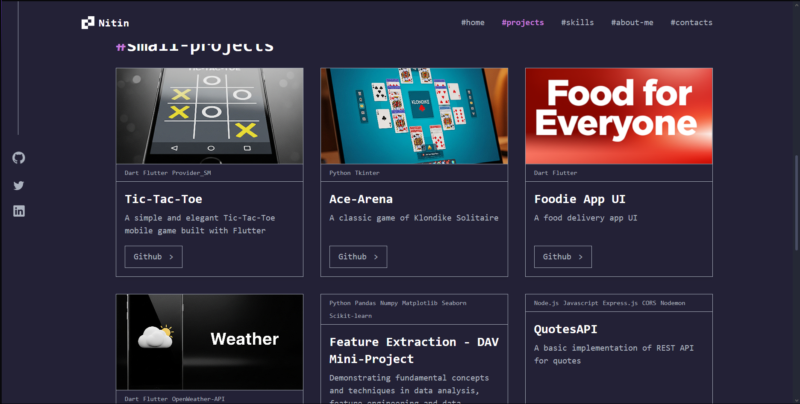

# Nitin's Portfolio

A modern, responsive portfolio website built with React, TypeScript, and Vite. This project showcases my work, skills, and background as a software and mobile app developer. The design is inspired by a dark, elegant theme with a focus on usability and aesthetics.

---

## Contents

- [About](#about)
- [Features](#features)
- [Technologies Used](#technologies-used)
- [Prerequisites](#prerequisites)
- [Installation](#installation)
- [Usage](#usage)
- [Deployment](#deployment)
- [Project Structure](#project-structure)
- [Screenshots](#screenshots)

---

## About

This project is a modern, single-page portfolio website designed to highlight a developer's projects, skills, and contact information. Built with React, TypeScript, and Vite, it features a highly responsive layout, a dark-themed aesthetic, and modular code organization. The site includes dedicated sections for featured projects, a skills overview, an about section, and contact details, all presented in a visually engaging and user-friendly manner. The codebase is structured for scalability and maintainability, making it easy to extend or adapt for other developers.

---

## Features

- Modern, dark-themed, single-page scrollable layout
- Highly responsive design for desktop and mobile
- Showcases featured projects with images and tech stacks
- Skills and technology stack section
- About me and contact information
- Downloadable resume
- Modular, maintainable code structure

---

## Technologies Used

- **Frontend:** React, TypeScript, Vite, Tailwind CSS
- **Routing:** React Router DOM
- **Linting/Formatting:** ESLint
- **Design:** Figma (for design inspiration)

#### Skills & Tools Highlighted

- Languages: C, C++, Python, Dart, R, JavaScript, MATLAB
- Frameworks: Flutter, React, Node.js, Express.js, Flask, Socket.io, Vite
- Databases: SQLite, SQL, MongoDB, Firebase
- Tools: VSCode, Android Studio, Git/GitHub, Linux, Figma, Postman, Archimate
- Other: HTML, CSS, REST API

---

## Prerequisites

- Node.js (v16 or above recommended)
- npm or yarn

---

## Screenshots

### Home



### About



### Projects Home



### Projects



---

## Installation

1. **Clone the repository:**
   ```bash
   git clone <repo-url>
   cd thePortfolio
   ```
2. **Install dependencies:**
   ```bash
   npm install
   # or
   yarn install
   ```

---

## Usage

- **Development server:**

  ```bash
  npm run dev
  # or
  yarn dev
  ```

  The app will be available at `http://localhost:5173` by default.

- **Build for production:**

  ```bash
  npm run build
  # or
  yarn build
  ```

- **Preview production build:**

  ```bash
  npm run preview
  # or
  yarn preview
  ```

- **Resume:** Downloadable at [public/Resume.pdf](public/Resume.pdf)

---

## Deployment

The site can be deployed to any static hosting service (Vercel, Netlify, GitHub Pages, etc.).

**Live Link:** _Coming soon_

---

## Project Structure

```
thePortfolio/
├── public/
│   ├── screenshots/           # Website screenshots for README
│   ├── projects/              # Project images
│   └── Resume.pdf             # Downloadable resume
├── src/
│   ├── assets/
│   │   └── images/            # UI images/icons
│   ├── components/
│   │   ├── Header.tsx         # Top navigation bar
│   │   ├── Sidebar.tsx        # Sidebar navigation
│   │   ├── Footer.tsx         # Footer section
│   │   ├── constants.ts       # App-wide constants
│   │   └── screens/
│   │       ├── home/          # Home screen
│   │       ├── about-me/      # About me section
│   │       ├── projects/      # Projects showcase
│   │       └── contacts/      # Contact section
│   ├── App.tsx                # Main app component (routes/screens)
│   ├── main.tsx               # React entry point
│   └── index.css, App.css     # Global styles
├── package.json
├── tailwind.config.js
└── ...
```

---
